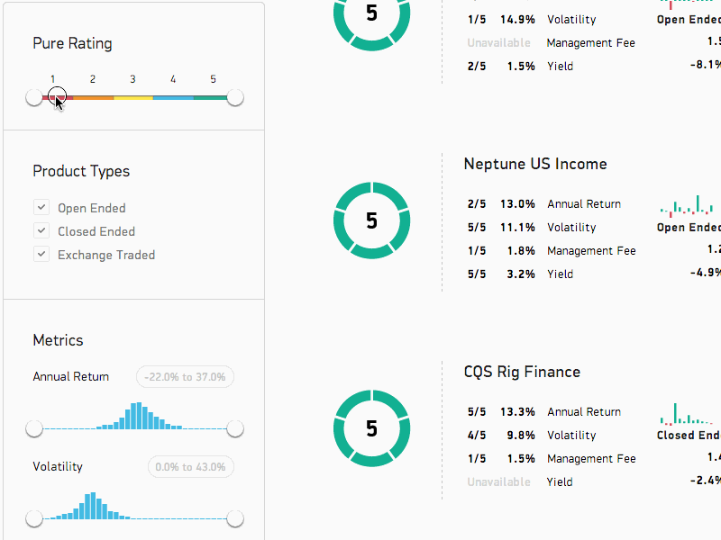

PureResearch is a powerful tool for users to research investments. Built on Node.js with MongoDB, the app allows searching of investment products by location, tag, or by individual metrics such as risk return or income loss. D3.js is used to generate graphs showing a product's performance over time and relative to every other product.

  

Filters and D3 graphs:

  

